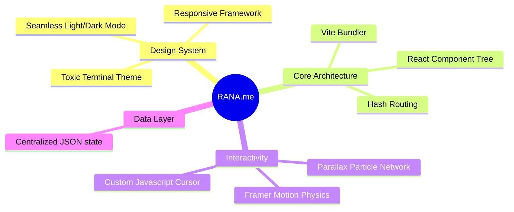

<div align="center">


<p align="center">
  <a href="#features">Features</a> •
  <a href="#demo">Demo</a> •
  <a href="#installation">Installation</a> •
  <a href="#tech-stack">Tech Stack</a>
</p>

[](https://thunderrbox.github.io/Portfolio)
[](https://react.dev)
[](https://vitejs.dev/)

<p align="center">A high-performance, dark-mode-first developer portfolio engineered for speed and aesthetic depth. Built with React and Vite, featuring 3D tilt cards, spring-physics animations, a custom physics cursor, and a heavy terminal theme. ✨</p>

</div>

## ✨ Features

<div align="center">



</div>

## 🚀 Demo

Experience the live portfolio at [Coming Soon]

## 🛠️ Installation

1️⃣ Clone the repository:
```bash
git clone https://github.com/thunderrbox/Portfolio
```

2️⃣ Navigate to project directory:
```bash
cd Portfolio
```

3️⃣ Install dependencies:
```bash
npm install
```

4️⃣ Run development server:
```bash
npm run dev
```

5️⃣ Open in browser:
- Visit [http://localhost:5173](http://localhost:5173)

## 💻 Tech Stack

<table align="center">
  <tr>
    <td align="center" width="96">
      
      <br>React
    </td>
    <td align="center" width="96">
      
      <br>Vite
    </td>
    <td align="center" width="96">
      
      <br>JavaScript
    </td>
    <td align="center" width="96">
      
      <br>CSS3
    </td>
  </tr>
</table>

## ⚡ Core Features

- 📱 **Responsive Design**
  - Fluid typography and viewport scaling
  - Flawless formatting on mobile and desktop
  
- 🎯 **Advanced Interactions**
  - Custom DOM interpolation for unblocked cursor rendering
  - 3D perspective hover cards using React Parallax Tilt
  - Spring-physics reveal animations globally

- 🎨 **Systems Styling**
  - Vanilla CSS design system mapping
  - Zero-flash Light/Dark mode transitions

## 📄 License

<div align="center">

MIT License © [Abhijeet Singh Rana](LICENSE)


</div>
